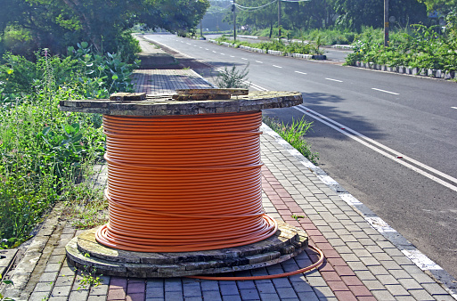

# Abgabe zur Lernveranstaltung Programmiersprachen im Web.
### Anmerkung: Es wurde keine explizite Einschränkung der Verwendung von JavaScript in der Aufgabenstellung erwähnt, daher wird angenommen, dass die Verwendung von JavaScript erlaubt ist."

# Lightmesh - Internetdienstleistungen
Diese Webseite stellt das Unternehmen Lightmesh und dessen Internetdienstleistungen vor. Der Benutzer kann sich über die verschiedenen Angebote von Lightmesh informieren und sich mit dem Unternehmen in Kontakt setzen.

## Funktionen
- Übersicht über verschiedene Internet-Pakete von Lightmesh und deren Preise
- Möglichkeit, sich über das Unternehmen Lightmesh und dessen Geschichte zu informieren
- Kontaktformular, um sich mit Lightmesh in Verbindung zu setzen
- Slider mit Bildern, die das Angebot von Lightmesh visualisieren

## Verwendung
1. Öffne die Webseite in deinem Browser.
2. Navigiere durch die verschiedenen Seiten, indem du auf die Navigation links oben klickst oder das Dropdown-Menü verwendest.
3. Erfahre mehr über das Unternehmen Lightmesh und seine Angebote, indem du die entsprechenden Seiten aufrufst.
4. Verwende das Kontaktformular, um dich mit Lightmesh in Verbindung zu setzen, wenn du Fragen oder Anregungen hast.

## index.html
Die index.html ist die Hauptseite der Website. Sie enthält den Navigationsbereich, den Header mit dem Slider und den Hauptinhalt der Seite. Der Slider wird durch JavaScript gesteuert und die Bilder werden aus dem Verzeichnis "assets/images" geladen. Im Hauptinhalt werden Informationen über die verschiedenen Internetpakete von Lightmesh angezeigt und es gibt eine Tabelle mit Kundenbewertungen. Die Seite verwendet auch externe CSS Dateien aus dem Verzeichnis "style" und eine JavaScript Datei aus dem Verzeichnis "script".

## sub/options.html
Die options.html ist eine Unterseite, die weitere Informationen über die verfügbaren Internetpakete von Lightmesh bereitstellt. Es gibt eine Tabelle mit detaillierten Angaben zu Geschwindigkeit, Preis und Inklusiveleistungen für jedes Paket.

## sub/about.html
Die about.html ist eine weitere Unterseite, die Informationen über das Unternehmen Lightmesh bereitstellt. Es gibt eine kurze Übersicht über die Geschichte und das Team von Lightmesh sowie eine Liste von Fakten und Zahlen.

## Kontakt
Am Ende der index.html gibt es einen Kontaktbereich mit einem Formular, über das die Benutzer mit Lightmesh in Kontakt treten können. Das Formular wird mithilfe von HTML und CSS gestaltet und das Absenden der Daten wird über eine PHP Datei verarbeitet.

# Bezug Aufgabenstellung
## Listen:
index.html#main
```HTML
 <p>Wir bieten drei verschiedene Pakete an:</p>
    <ul>
        <li>Basic: 50 Mbit/s für 19,99 € im Monat</li>
        <li>Premium: 100 Mbit/s für 29,99 € im Monat</li>
        <li>Pro: 200 Mbit/s für 49,99 € im Monat</li>
    </ul>
```

## Tabellen:
sub/options.html
```HTML
<table>
    <tr>
        <th>Paket</th>
        <th>Geschwindigkeit</th>
        <th>Preis pro Monat</th>
    </tr>
    <tr>
        <td>Basic</td>
        <td>50 Mbit/s</td>
        <td>19,99 €</td>
    </tr>
    <tr>
        <td>Premium</td>
        <td>100 Mbit/s</td>
        <td>29,99 €</td>
    </tr>
    <tr>
        <td>Pro</td>
        <td>200 Mbit/s</td>
        <td>49,99 €</td>
    </tr>
</table>
```

## Bilder:
index.html#main, style/gallery.css, script/gallery.js
```HTML
<div id="gallerybox">
    <div class="slider" id="slider1">
        <div class="slider-inner">
            
            
            
            
        </div>
        <button class="slider-prev">&lt;</button>
        <button class="slider-next">&gt;</button>
    </div>
    <script src="script/gallery.js"></script>
</div>
```

## Verzweigungen auf andere Seiten:
index.html#nav
```HTML
<nav>
    <div id="navlogo"><a href="index.html"></a></div>
    <div id="navbuttons"><label>
        <select onchange="location = this.value">
            <option value="index.html">Home</option>
            <option value="sub/options.html">Optionen & Preise</option>
            <option value="sub/about.html">Über uns</option>
            <option value="#contact">Kontakt</option>
        </select>
    </label></div>
</nav>
```

sub/about.html, sub/options.html
```HTML
<a href="../index.html"></a>
```

## einzeilige und mehrzeilige Eingabefelder:
index.html#contact
```HTML
<div id="formular">
    <form>
        <label for="name">Name:</label><br>
        <input type="text" id="name" name="name"><br>
        <label for="email">E-Mail:</label><br>
        <input type="email" id="email" name="email"><br>
        <label for="message">Nachricht:</label><br>
        <textarea id="message" name="message"></textarea><br>
        <input type="submit" value="Senden">
    </form>
</div>
```

style/main.css
```CSS
#formular input[type="text"], #formular input[type="email"], #formular input[type="tel"], #formular textarea {
    width: 70%;
    padding: 12px 20px;
    margin: 8px 0;
    box-sizing: border-box;
    border: 2px solid #ccc;
    border-radius: 4px;
}

#formular input[type="submit"] {
    width: 50%;
    background-color: #333;
    color: #ffffff;
    padding: 14px 20px;
    margin: 8px 0;
    border: none;
    border-radius: 4px;
    cursor: pointer;
}
```

## Radio-Buttons, Checkboxen:
options.html
```HTML
<div id="buchen">
    <label for="basic">Wähle ein Paket:</label><br>
    <input type="radio" id="basic" name="paket" value="basic" checked>Basic<br>
    <input type="radio" id="premium" name="paket" value="premium">Premium<br>
    <input type="radio" id="pro" name="paket" value="pro">Pro<br>
</div>
```

index.html#main
```HTML
<div id="störungsmeldung">
    <h2>Störungsmeldung</h2>
    <p>Bitte geben Sie hier Ihre Störungsmeldung ein:</p>
    <p>Ich habe momentan folgende Störungen:</p>
    <br>
    <input type="checkbox" id="keineVerbindung" name="störungen" value="keineVerbindung">
    <label for="keineVerbindung"> Keine Verbindung</label><br>
    <input type="checkbox" id="langsameVerbindung" name="störungen" value="langsameVerbindung">
    <label for="langsameVerbindung"> Langsame Verbindung</label><br>
    <input type="checkbox" id="abbrüche" name="störungen" value="abbrüche">
    <label for="abbrüche"> Verbindungsabbrüche</label><br>
    <input type="checkbox" id="sonstige" name="störungen" value="sonstige">
    <label for="sonstige"> Sonstige Störungen</label><br><br>
    <button type="submit">Absenden</button>
</div>
```

## Auswahllisten mit einer und mit mehreren Auswahlmöglichkeiten:
index.html#nav
```HTML
<nav>
    <div id="navlogo"><a href="index.html"></a></div>
    <div id="navbuttons"><label>
        <select onchange="location = this.value">
            <option value="index.html">Home</option>
            <option value="sub/options.html">Optionen & Preise</option>
            <option value="sub/about.html">Über uns</option>
            <option value="#contact">Kontakt</option>
        </select>
    </label></div>
</nav>
```
